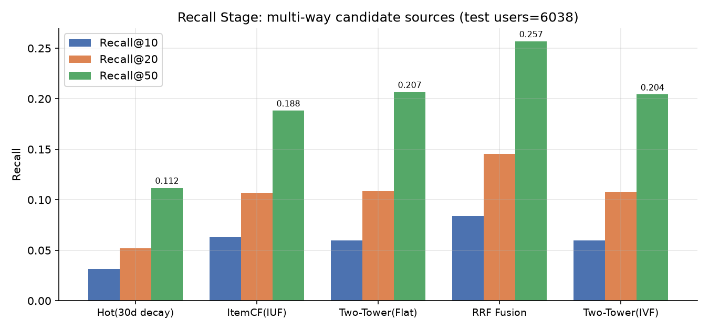
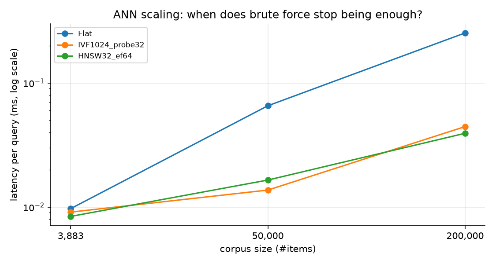
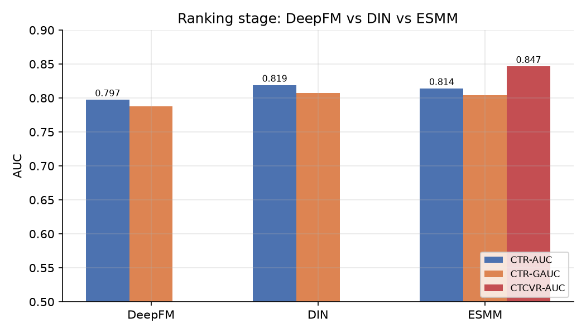
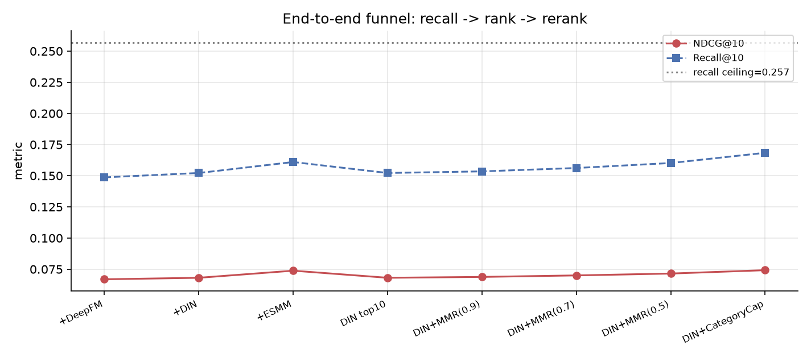
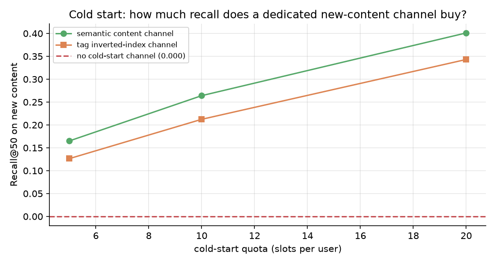
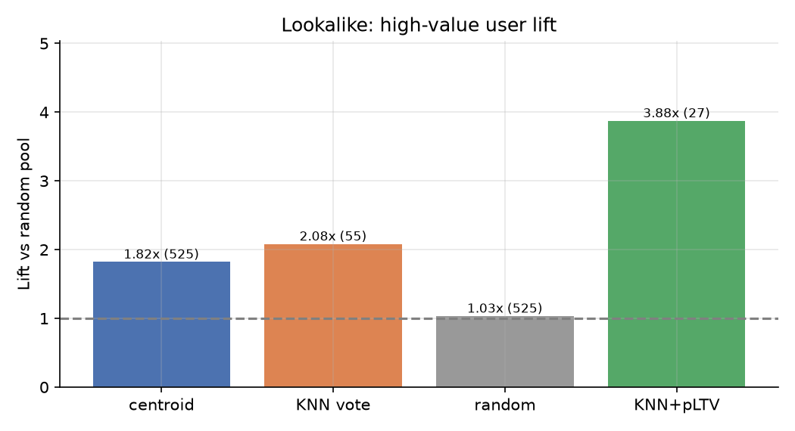
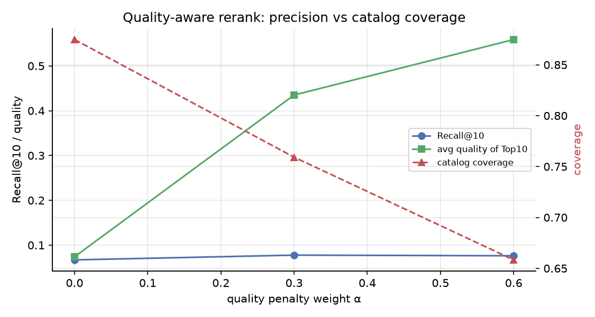
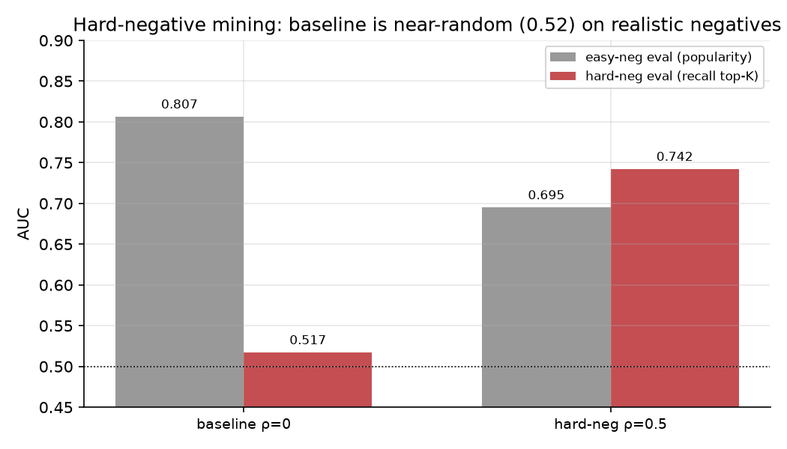

# UGC-RecSys-Pipeline

**面向内容社区 / 游戏社区场景的推荐系统全链路实现：召回 → 精排 → 重排 → 冷启动 → 用户增长。**

以 MovieLens-1M（100 万条真实行为）为公开基准，从零实现一套可复现、可评测、带数据护栏的工业级推荐流水线。仓库里的每一个指标都由本仓库代码 + 固定随机种子真实跑出，不含手工修饰；踩过的坑（两类数据泄漏）也如实记录并写成了回归测试。

---

## 核心特性

- **多路召回**：ItemCF（IUF 加权 + Top100 近邻）、双塔向量（batch 内负样本 softmax + 流行度 logQ 修正）、时间衰减热榜，Reciprocal Rank Fusion 融合
- **向量检索**：Faiss Flat / IVF / HNSW 统一封装，附召回保持率 vs 吞吐的实测权衡，以及库规模从 4k → 20 万的规模效应实验
- **精排与多目标**：DeepFM、DIN（target attention）、ESMM（CTR + CVR，pCTCVR = pCTR × pCVR）三种结构**同输入对照**，差距可干净归因
- **多样性重排**：MMR 连续旋钮 + 类目硬打散，同时报告精度（NDCG）与生态指标（ILD / 覆盖率 / 新颖度）
- **新内容冷启动**：内容语义通道 + 标签倒排通道 + 「扶持额度」旋钮，量化每多给一个坑位能买回多少召回
- **用户增长**：SVD 行为向量 KNN Lookalike 人群扩展 + pLTV 价值模型两步法，按时间窗口切分避免标签退化
- **内容质量与意图**：贝叶斯平滑质量分（held-out AUC 0.728 vs 热度 0.619）+ 用户意图画像 → 意图标签召回（新内容 Recall@50 0.640）+ 质量感知重排
- **难负例挖掘**：召回 Top-K 难负例混入训练，并暴露 baseline 在真实曝光分布下 AUC 仅 0.517 的关键事实
- **在线模拟与 A/B 框架**：行为模拟器（含先验校准）、SRM 校验、用户级 bootstrap、CUPED 方差削减、MDE 功效分析
- **SQL 特征工程**：画像口径全部写在可读的 DuckDB SQL（CTE + 窗口函数 + 时间衰减）里，另有等价 pandas 兜底实现
- **53 个 pytest 用例**：指标与 sklearn 对拍、训练/测试隔离校验、冷启动物品隔离校验、attention masking 行为校验、A/B 统计工具校验

---

## 系统架构

```
                        ┌──────────── 离线 ────────────┐
  ratings.dat ──┐       │  DuckDB SQL 画像特征          │
  movies.dat  ──┼──► 01 prepare ──► 02 语义编码 ──► 03 双塔
  users.dat   ──┘       │  用户/物品统计   item/tag 向量  └──► 04 Faiss 建索引
                        └──────────────────────────────┘
                                     │
 ┌─────────────────────── 在线请求（scripts/09_demo_serve.py）────────────────────┐
 │  用户请求                                                                       │
 │    ├─ 召回 ─┬─ ItemCF（IUF + Top100 近邻）                                       │
 │    │        ├─ 双塔向量（Faiss IVF）                                             │
 │    │        └─ 时间衰减热度榜（兜底 / 新用户）                                    │
 │    ├─ 融合 ─── Reciprocal Rank Fusion（只看 rank，免疫量纲漂移）    → Top80 候选   │
 │    ├─ 精排 ─── DIN target attention / ESMM(CTR&CVR)               0.12ms/用户    │
 │    └─ 重排 ─── MMR 多样性 + 类目打散(≤2/类)                        → Top10        │
 └────────────────────────────────────────────────────────────────────────────────┘
                                     │
                    08 增长：Lookalike 人群包 + pLTV 价值分层
                    07 冷启动：新内容独立通道 + 扶持额度
```

---

## 方法

### 1. 场景建模

MovieLens 的显式评分（1–5）先映射成业务漏斗，才能同时支撑召回与多目标建模：

| 漏斗层级 | 定义 | 数据构造 |
| --- | --- | --- |
| 曝光 | 候选物料库 | 全部 3,883 个 item |
| 点击 | rating ≥ 4 | 正样本（隐式反馈标准做法） |
| 转化 | rating = 5 | 深度互动（完播/点赞/收藏）的代理指标 |
| 负样本 | 用户未交互过的 item | popularity^0.75 采样，比例 1:4 |

**为什么是 popularity^0.75**：均匀负采样会让模型过度学习长尾（大量负样本从未真实曝光）；0.75 次幂（word2vec 经验值）在「贴近真实曝光分布」和「保留中长尾信号」之间取平衡。

**切分**：留一法（leave-one-out by time）——每用户最后一次点击进 test、倒数第二次进 valid、其余进 train，预测目标与线上一致（"下一个"而非"随机某个"）。增长模块因标签分辨率问题单独使用时间窗口切分（见 §6）。

### 2. 特征工程

用户侧画像：行为规模、点击/转化率、评分均值与方差、活跃月数、生命周期、近 10 次评分均值（口味漂移）。
物品侧画像：热度、口碑、**时间衰减热度**（半衰期 30 天，抑制老内容的马太效应）、去重用户数、内容年龄。

口径全部落在 `src/recsys/data/sql/*.sql`（DuckDB 方言），特征即文档。两条铁律：

1. **先切分、后算特征**——画像统计只允许来自训练集窗口，否则物品热度会把测试集信息泄露给模型；
2. 稠密特征统一 `log1p → z-score`，count=0 的冷启动物品经标准化后呈现负偏移，这本身就是「无历史」的有效信号。

### 3. 召回层

| 通道 | 职责 | 关键设计 |
| --- | --- | --- |
| ItemCF | 强共现信号，对老用户稳定可解释 | IUF 给活跃用户降权；相似度仅保留 Top100 近邻；时间衰减抑制过期共现 |
| 双塔向量 | 可泛化、可接内容特征、支持 ANN 毫秒检索 | batch 内负样本 softmax + logQ 频率修正；物品塔接入内容语义向量 |
| 时间衰减热榜 | 新用户兜底、保底多样性 | 半衰期 30 天的指数衰减热度 |

三路用 **RRF**（`score = Σ w/(60+rank)`）融合：只依赖 rank，天然免疫三路分数量纲与分布漂移。

### 4. 排序层

三种结构共享同一份特征 embedding 底座（user/item/gender/age/occupation/genre-pooled + 用户/物品统计），因此结构间的差距可归因：

- **DeepFM**：FM 显式二阶交叉 + DNN 隐式交叉，作为「无序列特征」时的对照基线；
- **DIN**：候选物品作为 query 对历史行为做 target attention，兴趣随候选变化；
- **ESMM**：`pCTCVR = pCTR × pCVR`，在全曝光空间监督 CTCVR、点击空间监督 CTR，绕开 CVR 的 sample selection bias。

### 5. 重排层

精排是 pointwise 的，看不见「列表内部的相互关系」。重排提供两个机制：

- **MMR**：`argmax[λ·rel − (1−λ)·max_sim(selected)]`，λ 是精度↔多样性的连续旋钮；
- **类目打散**：同一类目硬约束 ≤2 条。

### 6. 冷启动与用户增长

**冷启动**的数学事实：从未参与训练的 ID Embedding 是随机初始化，在协同模型眼里与噪声无异。解法是给新内容开独立通道（语义向量 / 标签倒排），再以「扶持额度」决定每个用户候选里给新内容留几个坑位——额度本身就是可运营的流量分配旋钮。

**用户增长**有两个独立于主链路的设计决策：

1. 留一法下每个用户未来只有 1 条行为，「用户价值」会退化成 0/1，因此增长标签按**时间窗口**单独切（后 20% 时间轴为未来窗口）；
2. Lookalike 不能用在整个训练集上学出的双塔用户向量（含未来窗口行为），本仓库只用过去窗口的行为矩阵现算 TruncatedSVD 向量，保证「推过去、看不未来」。

---

## 实验结果

所有数字均为本仓库代码真实跑出（测试集 6,038 用户，固定 seed=42）。

### 召回层：多路对比



| 召回通道 | Recall@10 | Recall@20 | Recall@50 | NDCG@20 |
| --- | ---: | ---: | ---: | ---: |
| 热度榜（30 天半衰期） | 0.0313 | 0.0520 | 0.1118 | 0.0208 |
| ItemCF（IUF + Top100） | 0.0633 | 0.1067 | 0.1883 | 0.0429 |
| 双塔（暴力检索） | 0.0598 | 0.1083 | **0.2067** | 0.0404 |
| 双塔（IVF100_probe20） | 0.0595 | 0.1072 | 0.2042 | 0.0400 |
| **三路融合（RRF）** | **0.0843** | **0.1454** | **0.2569** | **0.0572** |

双塔在 3.9k 物品的小物空间里只比 ItemCF 高 1.8pt——这是信息压缩到 64 维的代价；但两路 RRF 融合后比最强单路高 24%，多路的价值在互补而非单点最强。

### ANN 检索的 trade-off

真实双塔向量（3,883 items / 6,040 queries）：

| 索引 | 召回保持率 | QPS | 单查询延迟 |
| --- | ---: | ---: | ---: |
| Flat | 1.000 | 142,051 | 0.0070 ms |
| IVF100_probe10 | 0.926 | 203,854 | 0.0049 ms |
| IVF256_probe32 | 0.981 | 179,995 | 0.0056 ms |
| HNSW32_ef64 | 0.999 | 101,014 | 0.0099 ms |



在 4k 规模的库上**不该上 ANN**——Flat 已是量级最便宜的方案。把库规模推到 20 万后曲线才翻转：Flat 0.253ms → **IVF 0.0445ms（5.7×）且召回保持 100%**。索引选型是由数据规模决定的工程决策，不是技术品味问题。

### 精排与多目标



评估口径：valid 集每位用户 1 正例 + 99 条流行度负例。

| 模型 | 参数量 | CTR-AUC | CTR-GAUC | LogLoss | CTCVR-AUC |
| --- | ---: | ---: | ---: | ---: | ---: |
| DeepFM | 0.42M | 0.7975 | 0.7879 | 0.1879 | — |
| **DIN** | 0.44M | **0.8190** | **0.8072** | **0.1868** | — |
| ESMM | 0.48M | 0.8142 | 0.8042 | 0.1904 | **0.8467** |

- DIN 相对 DeepFM **+2.15pt AUC**：target attention 有效，代价只有 2 万参数；
- ESMM 的 CTR 分支略低于纯 DIN（多任务常见的负迁移），但额外拿到 CVR-AUC 0.761 / CTCVR-AUC 0.847，一份样本同时产出点击率与转化率；
- GAUC 普遍比 AUC 低约 1pt：模型在「用户之间」的比较上沾了活跃度的光，真实排序能力要看用户内比较。

### 端到端漏斗



候选集 80，召回命中率 **0.2569**——这是精排优化无法突破的天花板。

| 阶段 | Recall@10 | NDCG@10 | MAP@10 | ILD↑ | 类目覆盖↑ |
| --- | ---: | ---: | ---: | ---: | ---: |
| 召回 + DeepFM | 0.1487 | 0.0669 | 0.0428 | — | — |
| 召回 + DIN | 0.1522 | 0.0681 | 0.0433 | — | — |
| 召回 + ESMM | **0.1610** | **0.0738** | **0.0481** | — | — |
| DIN Top10（重排前） | 0.1522 | 0.0681 | 0.0433 | 0.6046 | 0.7693 |
| DIN + MMR(λ=0.7) | 0.1562 | 0.0700 | 0.0445 | 0.6310 | 0.7744 |
| **DIN + 类目打散(≤2/类)** | **0.1684** | **0.0742** | 0.0464 | **0.8143** | 0.7239 |

值得注意：类目打散在**提升精度的同时**把多样性拉高 35%——同质占位被移除后，真正相关的长尾内容才有机会浮上来。「精排最优 ≠ 列表最优」，列表级收益必须靠重排拿。

### 冷启动：新内容分发

93 件「全新内容」（训练集中行为全部抹除），3,975 个用户的 13,042 条 held-out 交互：

| 冷启通道 | 扶持额度 | Recall@50 | HitRate@50 | 新内容曝光率 |
| --- | ---: | ---: | ---: | ---: |
| 纯双塔（无冷启通道） | 0 | **0.0000** | 0.0000 | 55.9% |
| 内容语义通道 | 10 | 0.2640 | 0.5042 | 93.6% |
| **内容语义通道** | **20** | **0.4011** | **0.6659** | **98.9%** |
| 标签倒排通道 | 20 | 0.3431 | 0.6003 | 100% |



没有独立通道时新内容的 Recall 就是 0。额度 20 条即可把 Recall@50 拉到 0.40、覆盖率 98.9%。

### 用户增长：Lookalike + pLTV

时间轴切分（后 20% 为未来窗口，112,448 条交互），候选用户 5,363：

| 人群包 | 规模 | 高价值占比 | 相对大盘 Lift | 人均未来正向行为 |
| --- | ---: | ---: | ---: | ---: |
| 随机采样（基线） | 525 | 20.8% | 1.03x | 9.73 |
| 质心扩展 | 525 | 36.6% | 1.82x | 16.53 |
| KNN 投票扩展 | 55 | 41.8% | 2.08x | 15.84 |
| **KNN + pLTV 再筛选** | 27 | **77.8%** | **3.88x** | **32.11** |



价值模型：Spearman **0.611**、高价值识别 AUC **0.918**、Lift@10% **4.37**。相似度解决「像不像」，价值模型解决「值不值」，两个问题不能混为一谈。

### 内容质量评估与用户意图画像

内容理解不能停留在"生成了标签"，要验证它**能不能换到链路收益**。

**质量分**：贝叶斯平滑的 CTR/CVR（先验强度 m=50，避免 1 次曝光 1 次点击被当成 CTR=100%）+ 内容语义可发现性，合成入库可用的 quality score。Held-out 检验（未来窗口 197,663 条交互）：

| 打分方式 | 预测未来点击的 AUC |
| --- | ---: |
| 热度（log 曝光数） | 0.6186 |
| 原始 CTR（未平滑） | 0.7394 |
| **质量分（平滑 + 语义）** | **0.7276** |

质量分比热度高 10.9pt；与未平滑原始 CTR 基本持平但**低曝光物品不再被噪声主导**（曝光基尼系数 0.661）。

**用户意图画像**：把历史行为按时间衰减映射到 42 维受控标签词表上，得到可解释的意图分布（6,035 个用户有非空画像）。

**意图标签召回（第四路）**：

| 通道 | Recall@10 | Recall@50 |
| --- | ---: | ---: |
| 三路融合（基线） | 0.0843 | 0.2569 |
| 意图标签（单独） | 0.0111 | 0.0494 |
| 四路融合 | 0.0855 | 0.2569 |

单独看它很弱，但在**新内容**上 Recall@50 = **0.6398**、HitRate@50 = 0.831，显著高于行为召回（0.0）。因为它完全不依赖行为共现，是冷启动最有效的通道之一。

**质量感知重排**（`score = pCTR − α·penalty(低质)`，只惩罚不奖励，避免榜单退化成"经典榜"）：

| α | Recall@10 | ILD@10↑ | 覆盖率↑ | Top10 平均质量分 |
| ---: | ---: | ---: | ---: | ---: |
| 0.0 | 0.0671 | 0.5305 | 0.8748 | 0.074 |
| **0.3** | **0.0777** | 0.5541 | 0.7592 | 0.435 |
| 0.6 | 0.0763 | 0.5727 | 0.6583 | 0.559 |



这里有一个**真实的权衡**：α=0.3 时 Recall@10 +15.8%、列表质量分提升 5.9 倍，但目录覆盖率从 0.875 掉到 0.759。生态治理不是免费的——头部优质内容占据坑位必然挤压长尾曝光。α 应该按业务阶段调，不存在"越大越好"。

### 难负例挖掘（hard negative mining）

只用 popularity^0.75 负采样，模型学到的是「用户看过 vs 完全没听过」，而不是「用户会看到但不点」。把**召回 Top-200 中用户未正向交互**的样本作为难负例（ρ=0.5 混入）后：



| 负采样策略 | 易负例 AUC | 难负例 AUC | 难负例 GAUC | 难负例 LogLoss |
| --- | ---: | ---: | ---: | ---: |
| baseline（ρ=0） | 0.8066 | **0.5173** | 0.5098 | 0.4887 |
| hard-neg（ρ=0.5） | 0.6952 | **0.7423** | 0.7444 | 0.2004 |

**这是本项目最重要的一条负面结果**：baseline 在难负例评测上 AUC 只有 0.517，**几乎等于随机**。也就是说，只看易负例口径的 0.807 AUC 会严重高估模型在真实曝光分布下的判别能力。

同时要注意：**两个口径必须一起报**。难负例训练会让易负例 AUC 从 0.807 掉到 0.695——这不是退化，而是模型把概率质量从"明显不相关"转移到了"细粒度边界"。只报任一口径都会误导。

### 在线模拟与 A/B 实验框架

离线涨点不等于线上收益。`scripts/14_online_sim.py` 实现了完整闭环：

- **行为模拟器**：点击概率由 held-out 数据拟合的逻辑回归给出（相关度系数 6.24、质量分系数 0.43），并做**先验校准**把基线 CTR 对齐真实值 0.582——平衡采样拟合出的模型直接拿去模拟会得到 CTR≈0.84 的失真量级；
- **流量分配**：新内容扶持额度、低质降权、ε-greedy 探索流量；
- **A/B 框架**：user-level 哈希分桶、SRM 校验、以用户为单元的 bootstrap 比率置信区间、CUPED 方差削减、Welch t 检验、MDE 功效分析。

| 指标 | 对照组 | 实验组（冷启额度3 + 质量降权α=0.3） |
| --- | ---: | ---: |
| CTR | 0.5473 | 0.5467 |
| CTR 95%CI | [0.5394, 0.5552] | [0.5382, 0.5542] |
| CVR | 0.4317 | **0.4701** |
| 新内容曝光占比 | 0.0000 | **0.0112** |

- SRM 校验通过（p=1.0，分桶无偏）；
- CUPED 方差削减 **26.2%**；
- CTR 差异 −0.0021，95%CI [−0.0115, +0.0073]，**p=0.66 不显著**；
- MDE = 6.56%（每臂 3,020 用户）。

**结论要诚实**：CTR 没有可检出的提升，而 MDE=6.56% 说明这是**功效不足**，不能读作"策略无效"。CVR 有 8.9% 的相对提升且新内容曝光从 0 变为 1.12%——如果业务 OEC 是转化或生态健康度，这个策略是值得推的；如果 OEC 是 CTR，则需要更大流量或更长周期才能判定。这正是"先定 OEC 再看指标"的意义。

---

## 可靠性：两个真实踩到并修复的数据泄漏

推荐系统的线上事故大多来自数据，而不是模型。本仓库把两次踩坑沉淀成了回归测试：

| 问题 | 现象 | 修复 | 护栏 |
| --- | --- | --- | --- |
| **画像特征穿越**：用全量交互（含 test）统计物品热度 | 离线指标虚高，线上必然回落 | 画像只用 `split_tag == train` 统计 | — |
| **DIN 目标泄漏**：训练时目标物品本身在行为序列里 | train loss 一路降到 0.24，**valid AUC 反而从 0.65 崩到 0.60** | 按曝光时刻因果截断，每条样本只保留该时刻之前的行为；负样本与对应正样本共享同一 keep 值，否则模型从「历史长度」反推标签 | `tests/test_data.py::test_causal_mask_file_consistency` |

第二个坑的教训：**loss 优化得越漂亮，模型可能错得越离谱**。修复后双塔 valid Recall@50 从 0.145 提升到 0.215，DIN AUC 从 0.60 恢复到 0.819。

其它工程实践：

- 负采样批化实现：550k 正样本 × 4 负样本的耗时从 4.5min 降到 **2s**；
- 所有指标为手写实现并与 sklearn 对拍（`tests/test_metrics.py`）；
- best checkpoint 按 valid 指标挑选，不用 test 调参；全局固定随机种子；
- 单次请求端到端演示：`python scripts/09_demo_serve.py --user 7`（召回 → 精排 → 重排全程延迟打印）。

---

## 数据来源与校验

**数据是什么**：MovieLens-1M，GroupLens Research（明尼苏达大学）发布的公开学术基准，
含 **1,000,209 条评分行为**、6,040 个用户、3,883 部电影，时间跨度 2000-04-25 ~ 2003-02-28。
"百万级"指的是**行为记录条数**，不是用户数——用户规模是 6 千量级，这一点在
[docs/实验结果说明.md](docs/实验结果说明.md) 里同样写明。

**怎么拿到的**：官方源 `files.grouplens.org` 在本机网络下超时不可达，改从公开镜像获取：

| 文件 | 来源 | 字节数 |
| --- | --- | ---: |
| ratings.dat | GitHub 镜像 `ChicagoBoothML/DATA___MovieLens___1M`（Git Blob API） | 24,594,131 |
| movies.dat | 同一镜像经 jsDelivr CDN | 171,308 |
| users.dat | 同一镜像经 jsDelivr CDN | 134,368 |

**完整性校验**（`data/raw/` 下可用 `wc -l` / 首行比对复核）：

- 行数：ratings 1,000,209 / movies 3,883 / users 6,040，与官方规格一致；
- 首行 `1::1193::5::978300760` 与官方文档样例逐字符一致；
- 每用户最少 20 条评分，符合官方"每人至少 20 条"的采集约束；
- 评分分布 1~5 星分别为 56,174 / 107,557 / 261,197 / 348,971 / 226,310；
- 时间戳范围 956703932 ~ 1046454590，对应 2000-04-25 ~ 2003-02-28，与官方一致。

**怎么变成实验的**（口径全部落在 `scripts/01_prepare_data.py`，统计写入 `data/processed/dataset_stat.json`）：

1. 漏斗映射：rating ≥ 4 视为点击（正样本 550,164 条进入训练），rating = 5 视为转化；
2. 切分：按用户时间序留一法 → train / valid / test；另将 93 件物品的训练行为全部抹除，模拟新内容冷启动；
3. 负采样：popularity^0.75、正负比 1:4，共 2,750,820 条排序样本；
4. 各阶段指标写入 `results/*.json`，图表由这些 JSON 生成（`scripts/10_make_figures.py`），
   全流程 `python scripts/run_all.py` 一键复现，随机种子固定。

原始数据与模型权重**不入库**（体积与许可考虑），README 的快速开始给出了获取方式。

---

## 快速开始

```bash
# Python 3.12 + torch 2.5.1(cu121) 验证通过
pip install -r requirements.txt

# 数据放到 data/raw（MovieLens-1M 标准格式：ratings.dat / movies.dat / users.dat）
python scripts/01_prepare_data.py           # ~30s：SQL 画像 + 留一法切分 + 负采样
python scripts/02_build_content.py          # ~60s：bge-small-en-v1.5 内容向量 + 标签生成
python scripts/03_train_two_tower.py        # ~4min：双塔召回
python scripts/04_eval_recall.py            # 召回层评测 + ANN 权衡
python scripts/04b_ann_scaling.py           # ANN 规模效应（4k → 20 万）
python scripts/05_train_rank.py --model all # ~10min：DeepFM / DIN / ESMM
python scripts/06_eval_funnel.py            # 全链路漏斗 + 重排
python scripts/07_eval_coldstart.py         # 冷启动
python scripts/08_eval_growth.py            # 用户增长
python scripts/09_demo_serve.py --user 7    # 单次请求全链路演示
python scripts/11_content_quality.py        # 内容质量分 + 用户意图画像
python scripts/12_hard_negative.py          # 难负例挖掘（双口径评测）
python scripts/13_intent_rerank.py          # 意图召回 + 质量感知重排
python scripts/14_online_sim.py             # 在线模拟 + A/B 实验框架
python -m pytest tests -q                   # 53 passed
```

一键复现：`python scripts/run_all.py`。所有阶段产物落在 `data/processed/`（中间数据）与 `results/`（指标 JSON），图表由 `scripts/10_make_figures.py` 生成。

> 脚本依赖顺序：`11` 依赖 `02`（内容向量），`12`/`13` 依赖 `03`（双塔向量）与 `11`（质量分/意图），`14` 依赖 `03` 与 `11`。`run_all.py` 已按此顺序编排。

> 语义模型权重（[bge-small-en-v1.5](https://huggingface.co/BAAI/bge-small-en-v1.5)，133MB）需自备并放到 `models/bge-small-en-v1.5/`；缺失时内容相关通道自动跳过，主链路仍可运行。

---

## 目录结构

```
├── scripts/            14 个阶段的入口脚本，编号即执行顺序（run_all.py 一键串起）
├── src/recsys/
│   ├── common.py       种子 / 日志 / 计时 / 配置
│   ├── data/           数据读取、DuckDB SQL 特征、负采样、张量装载
│   ├── models/         two_tower.py（双塔） / rank.py（DeepFM · DIN · ESMM）
│   ├── recall/         index.py（Faiss 封装） / collaborative.py（ItemCF · 热度 · RRF）
│   ├── rerank/         mmr.py（MMR · 类目打散）
│   ├── growth/         lookalike.py（Lookalike · pLTV）
│   ├── coldstart/      content.py（语义向量 · 零样本标签 · 质量分 · 意图画像）
│   └── eval/           metrics.py（手写指标，含 GAUC / ILD / Lift）
├── tests/              53 个单测（指标对拍 + 泄漏护栏 + A/B 统计工具）
├── docs/               系统设计说明
└── results/            各阶段 JSON 指标
```

---

## 已知局限与路线图

诚实地说，这个项目还有这些没做完：

1. **难负例的收益尚未回流到主链路**：`12_hard_negative.py` 证明了 hard negative 能把难负例口径 AUC 从 0.517 提到 0.742，但主链路（`05_train_rank.py`）目前仍只用流行度负采样训练，两套口径的模型还没有合并成一套；
2. **双塔没有打过 ItemCF**：小物空间下 Embedding 侧仍有调参空间（更高维 + hard negative + 更长训练）；
3. **缺真正的多模态**：内容只有标题文本向量，没有图像 / 音频塔；游戏社区场景里封面图、视频帧才是大头；
4. **在线模拟不是真实用户**：`14_online_sim.py` 的点击行为由拟合出的逻辑回归生成，它能验证「统计框架是否正确」（SRM/CUPED/MDE/bootstrap），但无法替代真实 A/B——模拟器的行为分布本身就是从历史数据学来的，不存在真正意义上的"新策略改变了用户行为"这一反馈回路；
5. **质量降权的覆盖率损失没有闭环优化**：α=0.3 时目录覆盖率掉了 11.6pt（0.875→0.759），当前只是把权衡摆出来，没有做多目标优化去自动找帕累托前沿上的 α；
6. **增长模块规模偏小**：KNN 人群包只扩到 55 人，真实场景应按 DAU 量级重做。

优先级：难负例回流主链路 → 多模态内容塔 → 质量-覆盖率的多目标自动调参。

---

## 致谢

- [MovieLens](https://grouplens.org/datasets/movielens/1m/)（GroupLens Research）——基准数据集
- [BAAI bge-small-en-v1.5](https://huggingface.co/BAAI/bge-small-en-v1.5)——文本语义向量
- [faiss](https://github.com/facebookresearch/faiss)、[DuckDB](https://duckdb.org/)、[PyTorch](https://pytorch.org/)

## License

[MIT](LICENSE)
